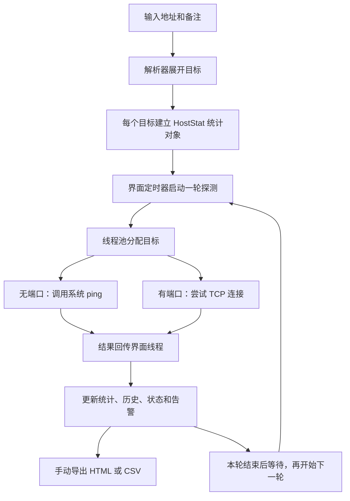

# Youqian-PingView 项目调查与技术解析

> 调查日期：2026 年 9 月 12 日  
> 仓库：<https://github.com/thousy/Youqian-PingView>  
> 分析基线：`69609bcafae57be0242735dfa2938ccb3f793700`  
> 文档性质：源码调查、受控验证与使用价值评估；不构成 UOS 实机验收报告。

## 1. 核心判断

Youqian-PingView 是面向 Linux／统信 UOS 的轻量桌面网络探测工具，用 Python 实现了类似 PingInfoView 的批量监控界面。

**项目已经有实质功能，适合研究和进一步完善；当前版本存在启动、结果归属和指标判断方面的明确缺陷，还不宜直接承担可靠的日常监控。**

本次检查覆盖仓库源码、安装与构建脚本、自动化测试、提交和发布记录，并进行了若干受控验证。完整的 UOS 图形界面、安装和长期运行没有实机验证。

本文区分三类证据：

- **源码事实**：能从固定提交的代码或文档直接确认。
- **验证结果**：本次实际执行测试、隔离导入或受控方法调用得到的结果。
- **分析判断**：根据上述证据推导的影响、适用场景和改进优先级。

所有仓库状态和结论均以调查日期及固定提交为边界，后续版本可能变化。

## 2. 项目规模与公开维护阶段

| 项目 | 本次核查结果 |
|---|---|
| 主要用途 | 批量检查主机响应、网络延迟、TCP 连接状态 |
| 主要技术 | Python，Qt／Tkinter 桌面界面，系统 `ping`，Python socket |
| 应用源码规模 | 应用包 14 个 Python 文件，约 2,533 行，包含注释和空行 |
| 仓库建立时间 | 2026 年 9 月 12 日 |
| 提交历史 | 一次初始提交 |
| Releases／版本标签 | 均为空 |
| GitHub Actions | 没有工作流运行记录 |
| 自动化测试 | 4 项核心测试 |

这些信息表明仓库刚开始公开维护，目前没有足够的历史记录判断长期稳定性。公开历史很短，不等于作者此前没有做过开发，但仓库没有提供更长的开发和验收证据。

代码中的 `1.0.0`、`1.0.2` 等版本文字，也不能视为已经完成过相应版本的正式发布。

来源：[仓库信息接口](https://api.github.com/repos/thousy/Youqian-PingView)、[固定提交](https://github.com/thousy/Youqian-PingView/commit/69609bcafae57be0242735dfa2938ccb3f793700)、[发布页面](https://github.com/thousy/Youqian-PingView/releases)。后两类仓库页面中的动态状态应以本文记录的调查日期为准。

## 3. 它解决什么问题

它解决的场景很具体：在一台电脑上，同时观察一批设备是否响应。

例如，办公室或机房里有路由器、交换机、打印机和服务器。逐个打开终端执行 `ping` 不方便，这个工具将目标放进同一张表，持续统计探测结果。

### 3.1 输入方式

```text
192.168.1.1 核心网关
192.168.1.10 办公服务器
192.168.1.20:443 内网网站端口
192.168.1.30-192.168.1.40 打印机
192.168.2.0/29 小型子网
[2001:db8::1]:443 IPv6端口示例
```

程序按行解析：前面是地址，后面是备注；网段和地址范围在一定规模内展开。最后一行使用文档示例地址，仅用于说明语法。

解析器支持：

- 单个 IPv4 地址或域名。
- 地址与中文备注。
- 小规模 CIDR 网段。
- IPv4 完整范围及末段简写范围。
- `host:port` 和 `[IPv6]:port`。
- 空行，以及以 `#`、`;`、`//` 开头的整行注释。

这是一套宽松解析器，接受输入不代表已经验证地址和端口合法。具体边界见第 6 节。[目标解析实现](https://github.com/thousy/Youqian-PingView/blob/69609bcafae57be0242735dfa2938ccb3f793700/uos_pingview/core/target_parser.py)

### 3.2 已有能力

| 能力 | 实现情况与边界 |
|---|---|
| 批量 ICMP 探测 | 调用系统 `ping`，每次向每个目标发送一个探测包 |
| TCP 探测 | 尝试建立指定端口的 TCP 连接，不检查 HTTP 页面或其他应用协议 |
| 上下双窗格 | 上面显示主机汇总，下面显示选中主机的近期记录 |
| 统计指标 | 成功／失败次数、失败率、延迟、TTL、连续失败等 |
| 筛选和搜索 | 可以只看异常、只看成功，按地址或备注过滤 |
| 告警 | 连续失败达到阈值时发出本机提示音 |
| 报表 | 界面支持 HTML、CSV，核心另有 TXT 导出函数 |
| 数据保存 | 统计和历史主要在内存中，没有数据库或自动持久化机制 |

从功能形态看，它面向现场排障和人工值守时的状态观察，例如观察设备是否间歇性失联，或比较几个目标的延迟变化。不过，当前缺陷会影响实际使用，不能仅凭功能列表就认定已经可靠。

对于跨天追溯、无人值守告警和业务服务健康判断，当前实现提供的能力有限。[主界面](https://github.com/thousy/Youqian-PingView/blob/69609bcafae57be0242735dfa2938ccb3f793700/uos_pingview/ui/main_window.py)、[统计与探测核心](https://github.com/thousy/Youqian-PingView/blob/69609bcafae57be0242735dfa2938ccb3f793700/uos_pingview/core/pinger.py)

## 4. 技术结构与数据流

正常的 Qt 路径可以概括成下面的流程。支持 Mermaid 的 Markdown 阅读器会将其显示为流程图。



| 文件 | 主要职责 |
|---|---|
| `uos_pingview/main.py` | 选择并启动图形界面 |
| `uos_pingview/qt_compat.py` | 尝试导入 PyQt5、PySide6、PyQt6 |
| `uos_pingview/core/target_parser.py` | 将输入文本转换为目标列表 |
| `uos_pingview/core/pinger.py` | 单次探测、单主机统计和历史记录 |
| `uos_pingview/ui/main_window.py` | Qt 界面、线程调度、结果消费 |
| `uos_pingview/ui/tk_window.py` | Tkinter 界面及另一套调度逻辑 |
| `uos_pingview/core/exporter.py` | 将当前汇总统计写成报表 |
| `build_deb.py` | 生成 DEB 安装包 |
| `run_uos.sh`／`install_uos.sh` | 启动程序／部署到系统目录 |

### 4.1 “双引擎”的实际含义

“双引擎”主要指两套图形界面，它们共用同一个探测核心。首选 Qt，预期在 Qt 不可用时退回 Tkinter。

这不是两套独立网络探测机制。界面切换也不能修复共用核心中的指标或探测语义问题。

### 4.2 并发在哪里实现

核心探测函数本身是同步的：ICMP 等待 `subprocess.run()`，TCP 等待 socket 建连；界面通过线程池避免这些等待直接阻塞窗口。

因此，“后台多线程探测”比文档中的“原生异步子进程池”更准确。

这种设计的优点是实现直接，核心模块可以脱离 GUI 测试；代价是 Qt、Tk 两边重复承担调度和生命周期管理，功能也已经出现差异。[Qt 调度实现](https://github.com/thousy/Youqian-PingView/blob/69609bcafae57be0242735dfa2938ccb3f793700/uos_pingview/ui/main_window.py#L403-L457)、[Tk 调度实现](https://github.com/thousy/Youqian-PingView/blob/69609bcafae57be0242735dfa2938ccb3f793700/uos_pingview/ui/tk_window.py#L439-L498)

## 5. 参数与指标应该怎样理解

程序默认配置如下：

| 参数 | 默认值 |
|---|---:|
| 轮次间等待时间 | 5 秒 |
| 单次超时配置 | 2,000 毫秒 |
| 每轮最大并发线程数 | 50 |
| ICMP 数据大小 | 32 字节 |
| 连续失败告警阈值 | 3 次 |
| 每个目标保留的近期记录 | 200 条 |

### 5.1 探测周期不是严格每五秒一次

程序在本轮结束后再等待 5 秒。一轮探测本身需要时间，目标越多、超时越多，实际采样周期越长。

README 所说的“毫秒级即时呈现”，对应收到结果后更新界面；它没有证明从故障发生到发现故障只需要毫秒级时间。

### 5.2 超时配置不等于整次操作的严格截止时间

Linux ICMP 路径会将超时向上取整到秒，最少 1 秒；外部命令还设置了额外的进程等待上限。此前的同步 DNS 解析没有被同一个整体超时包住。

因此，设置 2,000 毫秒，不代表包括 DNS 和所有处理在内的整次探测必然在两秒结束。

### 5.3 失败率不总等于网络丢包率

程序计算的是：

```text
失败率 = 探测失败次数 ÷ 全部探测次数 × 100%
```

TCP 连接失败、DNS 失败、命令异常和 ICMP 无响应的含义不同，不能全部理解为链路丢包。

### 5.4 TCP 延迟与 ICMP 延迟不能直接等同

TCP 的计时包含 DNS 解析、地址尝试和建连等开销；ICMP 延迟来自系统 ping 输出中的往返时间。二者不是同一种测量。

TCP 探测也不验证 TLS 握手、HTTP 状态码或业务响应。即使端口确实开放，也不足以确认网站或业务服务正常。

### 5.5 历史记录与统计范围不同

每个目标默认保留最近 200 条明细，较老记录被移出后，累计成功、失败次数仍继续增长。它不是“最近 200 次探测的统计窗口”。

### 5.6 TTL／HLIM 不代表实际经过的路由器数量

这里显示的是响应报文中的剩余限制值，不能把数值直接当作本机到目标经过了多少台路由器。

来源：[参数与统计实现](https://github.com/thousy/Youqian-PingView/blob/69609bcafae57be0242735dfa2938ccb3f793700/uos_pingview/core/pinger.py#L70-L155)、[底层探测实现](https://github.com/thousy/Youqian-PingView/blob/69609bcafae57be0242735dfa2938ccb3f793700/uos_pingview/core/pinger.py#L162-L283)、[IPv6 规范](https://www.rfc-editor.org/rfc/rfc8200.html#section-3)。

## 6. 影响实际使用的主要问题

### 6.1 TCP 端口拒绝连接，最终会被显示成“成功”

**证据类型：源码事实及受控模拟验证。**

探测函数遇到 `ConnectionRefusedError` 时，返回“成功标志 + 连接被拒（主机存活）”。随后统计对象把所有成功标志对应的状态统一改成“成功”。

受控模拟确认：

- 连接被拒后，最终成功次数增加。
- 失败率为 0。
- 连续失败被清零。
- 原来的“连接被拒”信息从最终状态及历史中丢失。

对网络诊断而言，拒绝连接可以说明收到了响应；但若要监控 `服务器:443`，它不能证明端口开放，更不能证明网站正常。

**影响：当前界面把不同含义合并，可能给出误导性的绿色状态。**

源码：[TCP 返回值](https://github.com/thousy/Youqian-PingView/blob/69609bcafae57be0242735dfa2938ccb3f793700/uos_pingview/core/pinger.py#L162-L182)、[统计状态覆盖](https://github.com/thousy/Youqian-PingView/blob/69609bcafae57be0242735dfa2938ccb3f793700/uos_pingview/core/pinger.py#L98-L137)。

### 6.2 更换目标后，旧结果可以写到新目标名下

**证据类型：源码事实及原方法的确定性执行验证。**

Qt 和 Tk 两套界面都存在同样的原因：后台结果只携带列表行号；接收时，程序用这个行号查询当前的目标列表。

点击停止不会取消已经执行的任务，也没有用目标身份或轮次区分旧结果。

受控复现步骤：

1. 第 0 行目标设为 `192.0.2.1`，执行探测并暂存结果回调。
2. 执行原 `stop_ping()` 方法。
3. 将第 0 行替换为新的目标 `198.51.100.2`。
4. 消费先前暂存的旧结果。

Qt、Tk 两条路径均得到：

```text
实际探测目标：192.0.2.1
程序运行标志：False
旧目标累计探测次数：0
新目标累计探测次数：1
新目标历史中的目标地址：198.51.100.2
新目标历史中的响应地址：192.0.2.1
```

验证采用 AST 提取源码中的原方法，绑定真实 `HostStat`，并使用最小界面替身、受控线程和回调队列，探测返回预设结果。没有加载 Qt，也没有访问网络。

**影响：这会污染新目标的统计和历史记录。** 本次没有测量真实 GUI 操作中发生的概率。

另外，Qt 连续两次手动全量刷新，在前一轮未结束时，可以生成两个独立轮次。配置的线程数限制针对每轮自己的线程池，因而重叠轮次可能突破用户理解的全局并发上限。重入行为已受控复现，实际压力影响未做负载测试。

源码：[Qt 调度与结果处理](https://github.com/thousy/Youqian-PingView/blob/69609bcafae57be0242735dfa2938ccb3f793700/uos_pingview/ui/main_window.py#L383-L457)、[Qt 更换目标](https://github.com/thousy/Youqian-PingView/blob/69609bcafae57be0242735dfa2938ccb3f793700/uos_pingview/ui/main_window.py#L638-L661)、[Tk 对应实现](https://github.com/thousy/Youqian-PingView/blob/69609bcafae57be0242735dfa2938ccb3f793700/uos_pingview/ui/tk_window.py#L432-L528)。

### 6.3 缺少 Qt 时，Tkinter 备用路径也会因 Qt 依赖失败

**证据类型：源码事实及隔离导入验证。**

导入 Tk 界面之前，Python 会先执行 `ui/__init__.py`，而该文件无条件导入 Qt 主窗口。没有 Qt 时，程序先因缺少 `QMainWindow` 失败，到不了备用界面。

隔离 PyQt5、PySide6、PyQt6 后，纯导入验证实际得到：

```text
ImportError: cannot import name 'QMainWindow'
from 'uos_pingview.qt_compat'
```

还有第二处耦合：Tk 界面为了取得示例文本，会导入 Qt 对话框模块 `target_dialog.py`。

**影响：README 的“零依赖保障、100% 开箱即用”不能成立。**

即使修复这两处耦合，仍需确认系统安装了可用的 Tk。Python 官方将 `tkinter` 标为可选模块，不能因为它属于标准库接口，就推断每台机器都有图形运行时。DEB 当前也没有声明 `python3-tk` 依赖。

源码与说明：[UI 包初始化](https://github.com/thousy/Youqian-PingView/blob/69609bcafae57be0242735dfa2938ccb3f793700/uos_pingview/ui/__init__.py)、[Tk 导入](https://github.com/thousy/Youqian-PingView/blob/69609bcafae57be0242735dfa2938ccb3f793700/uos_pingview/ui/tk_window.py#L15-L21)、[Python 官方说明](https://docs.python.org/3/library/tkinter.html)。

### 6.4 README 的 DEB 构建命令不能直接按说明复现

**证据类型：源码事实；未实际执行构建或安装。**

构建入口写死了作者本机路径：

```python
src = r"d:\AI_Project\pinginfoview3.5"
```

它没有自动采用当前项目目录，也没有提供路径参数。直接在普通 Linux 仓库目录中执行 `python3 build_deb.py`，不会正常以下载下来的仓库为源码目录构建。

脚本还会将包内版本均为 `1.0.2` 的内容，分别写入名为 `1.0.0`、`1.0.1` 和 `1.0.2` 的文件，造成文件名与包内版本不一致。

**影响：安装包生成和版本管理尚未形成可靠的交付流程。**

源码：[构建入口](https://github.com/thousy/Youqian-PingView/blob/69609bcafae57be0242735dfa2938ccb3f793700/build_deb.py#L184-L190)、[包内版本及依赖](https://github.com/thousy/Youqian-PingView/blob/69609bcafae57be0242735dfa2938ccb3f793700/build_deb.py#L39-L53)。

### 6.5 部分指标解析会产生错误数据

**证据类型：源码事实及受控样本验证。**

| 输入情形 | 程序结果 | 原因 |
|---|---|---|
| ping 输出包含 `from dns.google (8.8.8.8)` | 响应 IP 被提取成 `d` | 正则将主机名开头误当作十六进制地址，且没有验证完整 IP |
| 第一次成功但没有延迟值，第二次成功为 10ms | 平均延迟为 5ms，最小／最大均为 10ms | 延迟总和除以了包括缺失值在内的成功次数 |

“命令成功”和“字段解析正确”没有分别校验。系统 ping 输出格式发生变化时，界面可能显示成功，却附带错误指标。

**影响：响应地址与延迟统计需要独立校验，不能仅依赖成功退出码。**

源码：[响应 IP 解析](https://github.com/thousy/Youqian-PingView/blob/69609bcafae57be0242735dfa2938ccb3f793700/uos_pingview/core/pinger.py#L239-L261)、[平均值计算](https://github.com/thousy/Youqian-PingView/blob/69609bcafae57be0242735dfa2938ccb3f793700/uos_pingview/core/pinger.py#L106-L120)。

### 6.6 HTML 报表未转义输入内容

**证据类型：源码事实及临时输出文件检查。**

目标和备注直接插入 HTML 表格。受控检查确认，备注中的 HTML／脚本标签会原样进入生成文件。

导入别人提供的目标清单后生成报表，不可信备注可以改变报表内容，甚至嵌入脚本。

CSV 使用标准写入器和 UTF-8 BOM，这是合理的；但公式型内容也原样保留，打开后的行为取决于表格软件。本次仅检查生成内容，没有在浏览器或 Excel 中执行它。

**影响：报表导出缺少针对输出格式的内容处理，不能把外部备注直接视为可信内容。**

源码：[导出实现](https://github.com/thousy/Youqian-PingView/blob/69609bcafae57be0242735dfa2938ccb3f793700/uos_pingview/core/exporter.py#L40-L87)。

### 6.7 其他功能边界和说明不一致

| 项目宣称或使用预期 | 代码中的实际情况 |
|---|---|
| CIDR 批量展开 | 超过 1,024 个地址的网段保留为一个字符串目标，例如 `/16` 不会全部展开 |
| 智能输入解析 | 接受端口 `65536`；简写范围也可能产生非法 IP，缺少明确的错误反馈 |
| 两套界面体验一致 | Qt 有多选、复制、属性窗口；Tk 使用单选模式，未提供同等功能 |
| 停止后立即全量刷新 | Qt 的全量刷新因 `is_running=False` 直接返回，不执行探测 |
| 启动脚本自动安装依赖 | `README_UOS.md` 这样描述，实际 `run_uos.sh` 只启动程序 |
| 深度适配 UOS | 有 Linux 参数、中文界面、apt／DEB 和桌面入口；未见 V20／V25 实机验证记录 |

“大网段不展开”作为资源限制本身可以理解，问题在于没有明确提示限制，反而将整个网段字符串交给单目标探测流程。

源码：[解析器](https://github.com/thousy/Youqian-PingView/blob/69609bcafae57be0242735dfa2938ccb3f793700/uos_pingview/core/target_parser.py#L58-L122)、[Tk 界面](https://github.com/thousy/Youqian-PingView/blob/69609bcafae57be0242735dfa2938ccb3f793700/uos_pingview/ui/tk_window.py)、[启动脚本](https://github.com/thousy/Youqian-PingView/blob/69609bcafae57be0242735dfa2938ccb3f793700/run_uos.sh)。

## 7. 部署、原版关系与许可证

### 7.1 免 root 运行有前提

程序不自行创建原始 ICMP 套接字，而是调用系统 `ping`。普通用户能否执行探测，依赖系统工具的安装和权限配置。

系统级安装则明确要求管理员权限，将文件写到 `/opt`、`/usr/bin` 和 `/usr/share/applications`。运行权限与安装权限应分开理解。

安装脚本还存在两个诊断问题：

- 将任意 apt 失败都归因为 UOS 商业源 401，且隐藏错误输出，无法从该提示确认真实原因。
- 没有统一的失败退出或部署结果检查，部分操作失败后仍可能打印“安装成功”。

因此，“安装成功”的文字不能替代文件部署、依赖导入和程序启动检查。[安装脚本](https://github.com/thousy/Youqian-PingView/blob/69609bcafae57be0242735dfa2938ccb3f793700/install_uos.sh)

### 7.2 与 PingInfoView 的关系

从源码看，本项目用 Python 实现了与原版相近的功能和布局。仓库没有给出 NirSoft 官方移植或维护关系的证据。

原版 PingInfoView 官方说明还列有目标分组、自动保存、日志、自动导出、失败／恢复执行命令、源地址选择等能力。当前仓库没有完整实现这些功能。

README 中的“完全对标”更适合理解为开发方向，不能当作功能等价的验收结论。[原版官方文档](https://www.nirsoft.net/utils/multiple_ping_tool.html)

### 7.3 许可证资料不完整

README 宣称 MIT，但仓库没有完整的 `LICENSE` 文件。

附带的 `readme.txt` 是 Nir Sofer 原版 PingInfoView v3.25 的说明，其中写的是 freeware 再分发条款。仓库另有原版语言文件，当前 Python 界面没有引用它；中文界面文字写在 Python 源码中。

准确表述应为：**作者声明项目采用 MIT，但原创代码与第三方资料的授权边界尚需补齐。**

单凭这些文件不能进一步判断侵权，也不能把所有附带内容统一认定为 MIT。

来源：[项目声明](https://github.com/thousy/Youqian-PingView/blob/69609bcafae57be0242735dfa2938ccb3f793700/README.md)、[附带原版说明](https://github.com/thousy/Youqian-PingView/blob/69609bcafae57be0242735dfa2938ccb3f793700/readme.txt#L607-L614)。

## 8. 本次验证结果与边界

### 8.1 已完成的检查

| 检查 | 结果 | 能证明的范围 |
|---|---|---|
| 16 个 Python 文件语法解析 | 通过 | 语法可解析，不代表依赖或运行正确 |
| 3 个 shell 脚本 `bash -n` | 通过 | shell 语法，不代表安装流程正确 |
| 原有 4 项测试 | 全部通过 | 正常解析、基础统计、简单导出、当前环境 IPv4 回环 |
| Qt 缺失时的隔离导入 | 复现失败 | Tk 备用路径仍依赖 Qt |
| TCP 拒绝连接模拟 | 复现状态误判 | 关闭端口被累计为成功 |
| 原 UI 方法与受控回调 | 复现目标错配、Qt 轮次重入 | 给定调度顺序下的程序行为 |
| ping 输出与统计样本 | 复现响应 IP 和平均值错误 | 指定输入下的解析与计算缺陷 |
| 临时 HTML／CSV 检查 | 复现内容原样输出 | 输出文件内容，未验证浏览器或表格执行行为 |

原有测试命令：

```bash
python3 -m unittest discover -s tests -v
```

测试在当前 macOS、Python 3.14 环境中完成。首次沙盒内回环探测因 `Operation not permitted` 失败；确认是执行环境限制后，在允许回环探测的环境重跑，4 项全部通过。首次失败不计为仓库缺陷。

测试源码仅覆盖正常输入样本、基础统计、简单导出以及 `127.0.0.1` 的 ICMP 探测，没有覆盖本次发现的大多数问题。[原有测试](https://github.com/thousy/Youqian-PingView/blob/69609bcafae57be0242735dfa2938ccb3f793700/tests/test_core.py)

### 8.2 未验证的内容

- UOS V20／V25 的完整安装与图形界面启动。
- 不同 Qt binding 的完整 API 兼容性。
- X11／Wayland、不同硬件架构的运行组合。
- 真实 IPv6 网络探测。
- 数百目标负载及连续多日运行。
- 修改系统网络或依赖配置后的恢复能力。
- 完整安全审计或第三方授权审查。

本次调查没有修复项目源码，也没有执行系统安装或卸载。受控模拟与语法检查不能替代以上实机验收。

## 9. 使用价值与改进顺序

### 9.1 作为学习项目

它的学习价值高于当前的直接部署价值：规模较小，输入、探测、统计、界面、导出的链条完整，适合逐层理解一个桌面工具如何工作。

建议阅读顺序：

1. `target_parser.py`：看文本如何变成结构化目标。
2. `pinger.py`：看单次探测结果怎样进入累计统计。
3. `main_window.py`：看线程、界面更新和用户操作如何相互影响。
4. `exporter.py`：看内部状态如何成为对外报表。
5. `main.py`、`qt_compat.py`、安装脚本：看“代码存在”与“用户可以启动”之间还需要哪些条件。

尤其值得学习的是：成功状态的业务含义、异步结果的身份绑定，以及测试证据与产品结论之间的边界。

### 9.2 作为实际工具

当前版本可以作为评估和修复的起点。若用于实际观察，应先验证关注的探测类型与操作路径，不应把绿色状态直接作为业务服务正常的依据，也不应把内存记录当作可靠的长期审计日志。

在本次发现的核心缺陷修复并验证前，不建议把它作为唯一的故障发现和可用性判断来源。

### 9.3 建议的改进顺序

| 顺序 | 应解决的问题 | 对应验收标准 |
|---|---|---|
| 1. 保证结果可信 | 区分主机响应与端口开放；绑定目标身份和轮次；防止旧结果写入及轮次重入 | 关闭端口不会被报告为开放；替换目标后旧结果不污染新记录；并发约束在运行全程有效 |
| 2. 保证能够交付 | 修复 Qt／Tk 依赖边界、构建路径、依赖声明和版本一致性 | 在明确的 UOS 环境中可安装、可启动；缺 Qt 场景与声明的回退行为一致 |
| 3. 保证指标与输出正确 | 输入校验、响应 IP 解析、缺失延迟处理、HTML 转义 | 已知样本产生独立预期结果；非法输入得到明确反馈；外部文本按目标格式安全输出 |
| 4. 补齐长期使用能力 | 按需求加入配置保存、历史持久化、告警方式 | 重启后的数据与设置符合定义；失败和恢复事件可验证；历史保存范围清楚 |

对这个项目有实际意义的验收问题是：**一次探测结果是否被正确解释、记到正确目标，并能在目标运行环境中稳定复现。** 当前这三方面都有需要修补的地方。
